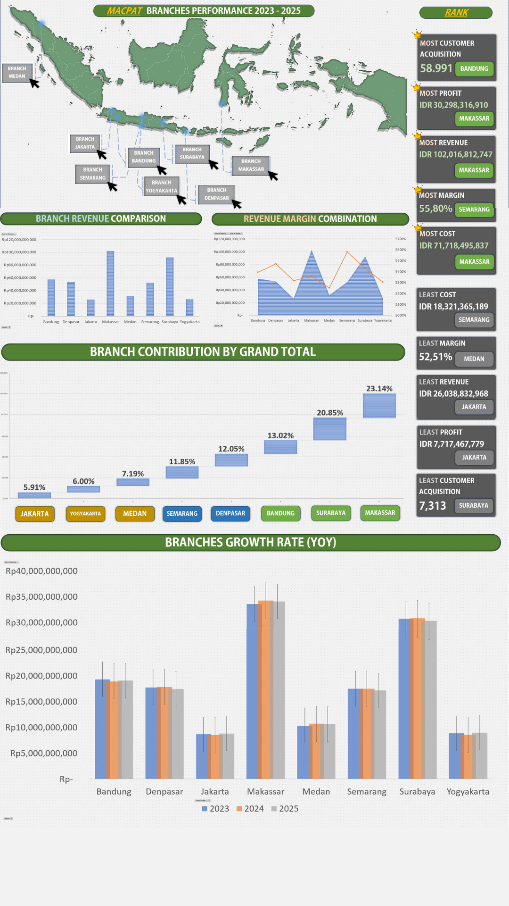

# MACPAT-Branch-Performance-Analysis
A data analytics project showcasing Excel ETL, data cleaning, multi-branch consolidation, KPI modeling, and dashboard visualization. Built to analyze revenue, profit, margin efficiency, and performance trends across multiple retail branches.

<h1> “About MACPAT Branch Performance Analysis - Excel Dashboard & KPI Evaluation” </h1>

<h2>Project Purpose;</h2>
Menganalisis performa produk dan penjualan dari berbagai cabang untuk mengidentifikasi tren, perbandingan antar cabang, dan KPI utama. Project ini dibuat sebagai bagian dari portofolio Data Analyst menggunakan Excel (Pivot, Dashboard, ETL sederhana).

<h2>Dataset Summary;</h2>		
<b>Sumber data:</b> Open dataset publik, modified. 
<b>Jumlah sheet sumber:</b> 8 branch dataset (Jakarta, Surabaya, Medan, Makassar, Bandung, Denpasar, Semarang, Yogyakarta). 			
<b>Jenis data: Kinerja Bisnis Harian:</b> Detail Cabang & Produk, Metrik Keuangan & Operasional. 	
<b>Tidak mengandung data sensitif.</b> 			
<b>Total baris data:</b> ± 180 Rows. 			
<b>Range waktu:</b> Q1 2023 - Q4 2025. 			
<b>Level granularitas:</b> Agregasi Harian [Produk, Cabang]. 		

<h2>Project Flow;</h2>						
[1] Inisiasi & Persiapan Data Sumber 		
Transformasi Raw Data (Power Query)Memanfaatkan Power Query untuk memanipulasi dan membagi dataset tunggal menjadi enam (6) sumber data cabang terpisah. Langkah ini memastikan data yang dihasilkan relevan dengan performa produk dan penjualan masing-masing cabang.	

[2] Integrasi & Pembersihan Data (ETL) 		
- Standardisasi Skema & Pembersihan Data 
Melakukan data cleaning menggunakan Power Query untuk standardisasi skema kolom, memastikan keseragaman format data (termasuk format tanggal dan mata uang), dan mengatasi isu inkonsistensi. 
- Konsolidasi Dataset Cabang 	
Menggunakan fungsi Append Power Query untuk menggabungkan (append) keenam dataset cabang terpisah ke dalam satu sheet tunggal, yaitu "AppendBranch", yang berfungsi sebagai master dataset untuk analisis.	

[3] Analisis Data & Perhitungan Metrik 
- Perhitungan Metrik Kinerja (KPIs) 	
Menghitung dan memvalidasi lima (5) metrik kinerja utama pada tingkat produk/cabang/harian: Sum of Margin, Sum of Profit, Sum of Revenue, Sum of Cost, dan Sum of Customer Acquisition. 	
- Analisis Multidimensi (Pivot Table)Menggunakan Pivot Table pada master dataset "AppendBranch" untuk analisis terperinci, berfokus pada kinerja per Cabang, per Produk, dan per Bulan.	

[4] Visualisasi & Interpretasi Hasil 			
- Desain Dashboard Kinerja 
Membuat Dashboard interaktif yang memvisualisasikan KPIs dan perbandingan kinerja antar cabang (seperti Revenue Comparison dan Contribution by Grand Total), dirancang untuk kebutuhan Manajer Cabang/Pusat. 	
- Penyusunan Insight Utama & Rekomendasi 
Menganalisis visualisasi tren untuk menyusun insight strategis utama, menginterpretasikan variasi kinerja, dan memberikan rekomendasi yang dapat ditindaklanjuti.	
	
<h2>Tools & Excel Features Used;</h2>		
PivotTable, 			
PivotChart, 			
Dashboard layout, 			
Data Cleaning (format normalization), 		
Consolidated branch datasets, 			
Basic KPI formulas, 			
Power Query, 			
Macros. 			

<h2>Key Insights;</h2>		
- Makassar Memimpin Kontribusi Profit:  
Cabang Makassar secara absolut merupakan pendorong finansial utama, mencatatkan Rp 30,30 Miliar Profit dan Rp 102,02 Miliar Revenue. Kinerja unggul ini menjadikannya benchmark operasional untuk seluruh jaringan cabang. 	
- Semarang Paling Efisien dalam Margin:  
Cabang Semarang menunjukkan efisiensi terbaik dengan tingkat Margin tertinggi sebesar 5580.7%. Hal ini menunjukkan keunggulan dalam penetapan harga atau manajemen biaya yang dapat dipelajari oleh cabang-cabang lain. 
- Surabaya Dekat Mengungguli Makassar:  
Meskipun Revenue Surabaya (Rp 91,91 Miliar) lebih rendah, Profit-nya (Rp 27,75 Miliar) relatif dekat dengan Makassar. Ini mengindikasikan bahwa peningkatan volume penjualan (Revenue) sekecil apa pun dapat membuat Surabaya menjadi pesaing terkuat bagi Makassar dalam waktu dekat. 			
- Kinerja Terendah di Jakarta: 
Cabang Jakarta dan Yogyakarta berada di posisi terbawah dalam hal Profit dan Revenue. Cabang Jakarta mencatat Revenue terendah (Rp 26,04 Miliar) dan Profit terendah (Rp 7,72 Miliar), mengindikasikan potensi pasar yang belum tergarap optimal dan perlunya evaluasi ulang strategi pemasaran lokal. 			

<h2>Map of Sheets;</h2>			
- =MakassarKPI 		 
- SurabayaKPI 		 
- BandungKPI 		 
- DenpasarKPI 		  
- SemarangKPI 		  
- MedanKPI 		
- YogyakartaKPI 		  
- JakartaKPI 		 
- Dashboard 		
- Pivotraw 		
- AppendBranch 		
- AbouThisFile 		
- MakassarBranch 		
- SurabayaBranch
- BandungBranch
- DenpasarBranch
- SemarangBranch
- MedanBranch
- YogyakartaBranch
- JakartaBranch 

<h2>A Disclaimer;</h2> 
Data pada file ini merupakan dataset publik yang telah dimodifikasi untuk keperluan analisis portofolio. Tidak mengandung data pribadi atau informasi perusahaan sebenarnya.		
